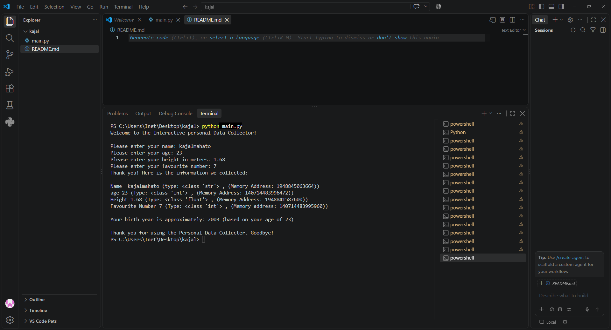

# 🧑‍💻 Interactive Personal Data Collector
## 📌 Project Description
The Interactive Personal Data Collector is a simple Python project designed for beginners to learn how to take input from users and work with different data types. The program collects the user's name, age, height, and favourite number, then displays the entered information along with its data type and memory address. It also calculates the user's approximate birth year based on their age. This project helps beginners understand important Python concepts such as variables, user input, type conversion, type(), id(), arithmetic operations, and f-strings.
## ✨ Features
* Collects the user's name
* Collects the user's age
* Collects the user's height
* Collects the user's favourite number
* Displays the data type of each value
* Displays the memory address using id()
* Calculates the approximate birth year
# 🛠️ Technologies Used
* Python
* VS Code
* github
* git
# ▶️ How to Run
1. Install Python
2. Open the project in VS Code
3. Open the terminal
4. Run: python main.py
# 📂 Project Structure
```text
├─main.py
├─output.png
├─README.md
```
# 📸 Output/Screenshots

# 👨‍💻 Author / Developer Name
** kajal **
